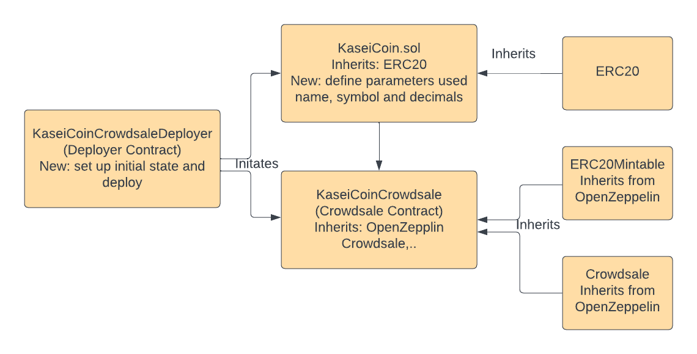
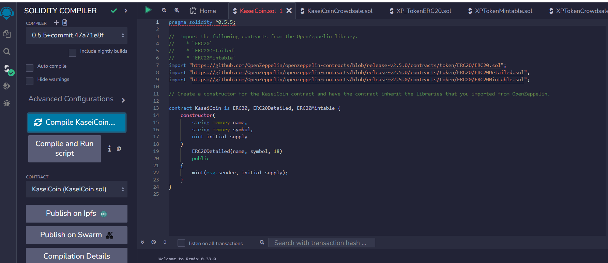
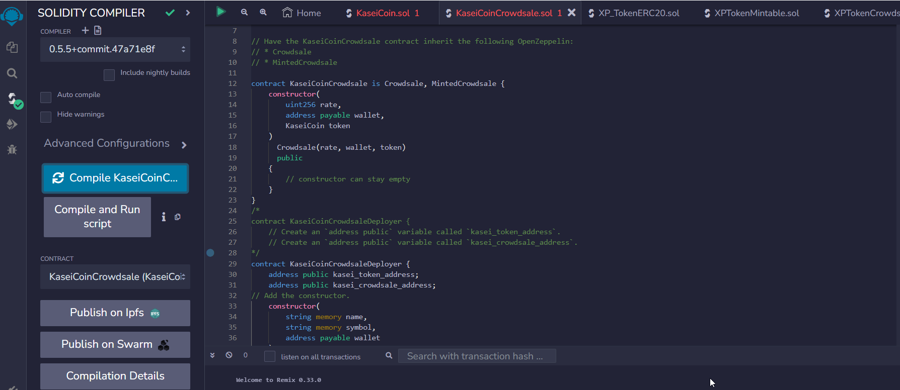
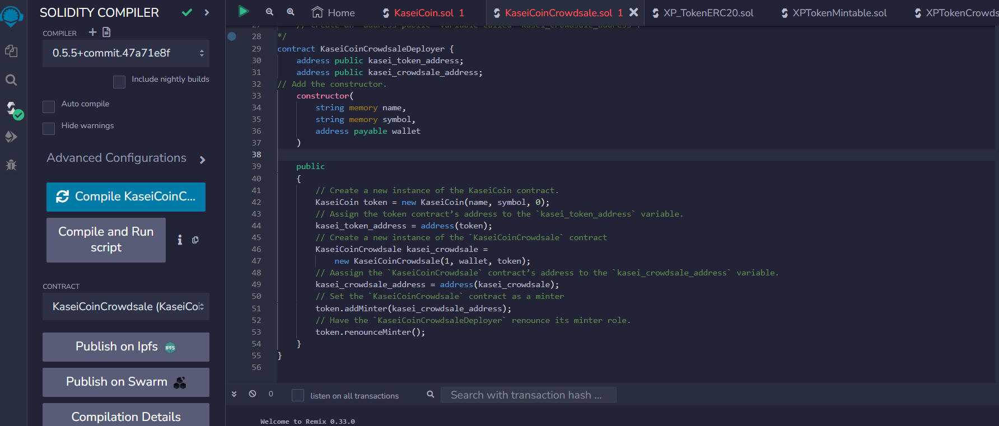
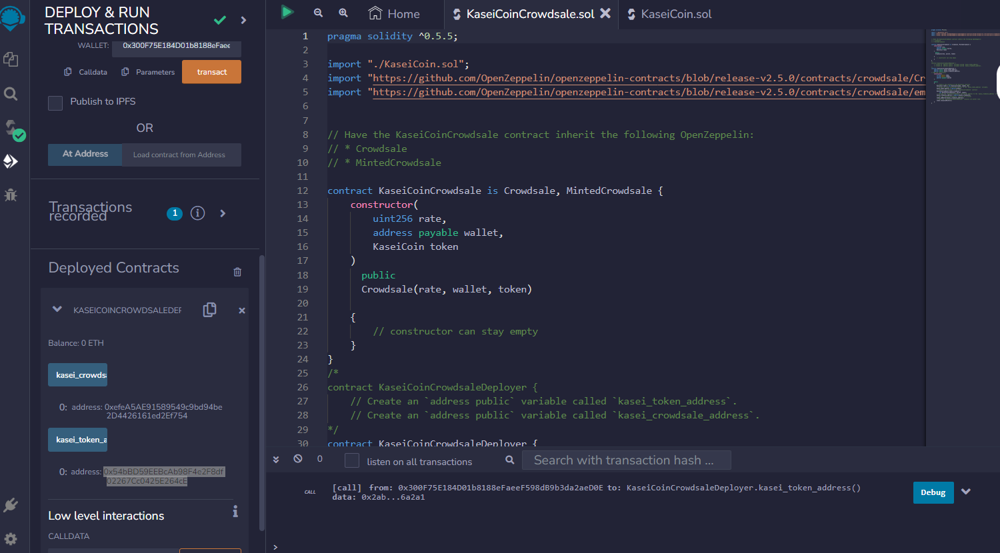
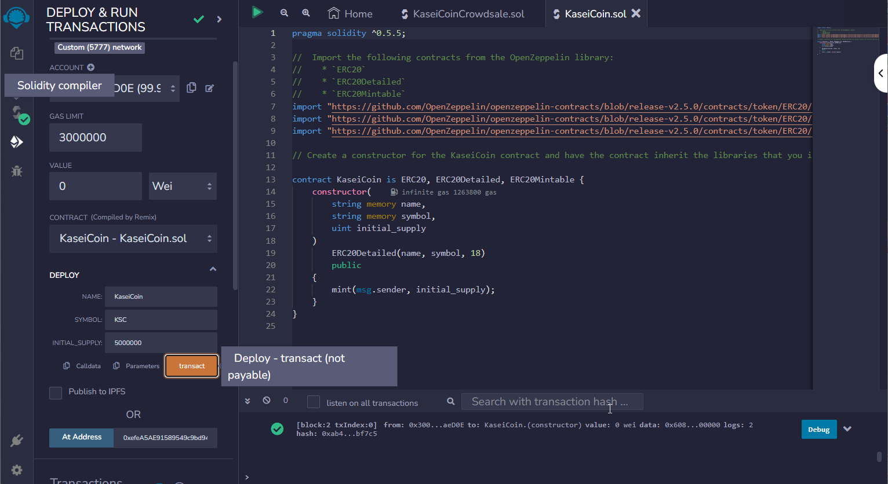

# Advanced Solidity Unit 21 Assignment

<h2 style="color:red;">Please check the files in master branch of github</h1>

Martian Token Crowdsale

After waiting for years and passing several tests, the Martian Aerospace Agency selected you to become part of the first human colony on Mars. As a prominent fintech professional, they chose you to lead a project developing a monetary system for the new Mars colony. You decided to base this new system on blockchain technology and to define a new cryptocurrency named **KaseiCoin**. (Kasei means Mars in Japanese.)
## Design of the Crowdsale Token

## Step 1 - Create KaseiCoin Token Contract. Screenshot of successful completion of the contract. Evaluation Evidence 1.

## 

## Step 2 - Create KaseiCoinCrowdsale Contract. Screenshot of successful completion. Evaluation Evidence 2.

## Step 3 - create KaseiCoinCrowdsaleDeployer. Evaluation Evidence 3.

## Step 4 - Deploy Crowdsale on Local Blockchain Ganache, Metamask

1. **Deploy KaseiCoinCrowdsaleDeployer contract**: We will start by deploying the `KaseiCoinCrowdsaleDeployer` contract. This contract is responsible for creating an instance of your token and the crowdsale contract.

   - For deploying, switch to the "Deploy & Run Transactions" tab.
   - Ensure that you are connected to the correct network (Ganache) and your Metamask wallet is also connected to Ganache.
   - From the "Contract" dropdown, select the `KaseiCoinCrowdsaleDeployer` contract, enter the constructor parameters and click on "Deploy".
   - Confirm the transaction in Metamask.

   Constructor Parameters:

   - name: Name of your token (e.g., "KaseiCoin").
   - symbol: Symbol of your token (e.g., "KSC").
   - wallet: Your Metamask account address (the account where the crowdsale funds will be transferred).

2. **Get contract addresses**: Once deployed, you can find the addresses of `KaseiCoin` and `KaseiCoinCrowdsale` contracts by calling the respective public methods (`kasei_token_address` and `kasei_crowdsale_address`) of the deployed `KaseiCoinCrowdsaleDeployer` contract.

3. **Interacting with the contracts**: After obtaining the addresses, you can interact with the contracts. For instance, you can:

   - Mint new tokens: On `KaseiCoin` contract, call the `mint` function by specifying the receiver's address and the amount to mint.
   - Buy tokens: On `KaseiCoinCrowdsale` contract, you can simulate buying tokens by sending Ether to it.
   - Transfer tokens: On `KaseiCoin` contract, call the `transfer` function to send some tokens to another account.

4. **Testing**: You can test your contract functions by running various scenarios:

   - Try minting tokens to various addresses and check their balances.
   - Try buying tokens with different amounts of Ether and ensure the token balance of the buyer is updated correctly. Also, ensure that the Ether balance of the `wallet` specified in the constructor of `KaseiCoinCrowdsaleDeployer` contract is increasing.
   - Try transferring tokens between different addresses and ensure balances are updated correctly.

# See video for demo in Image subfolders

